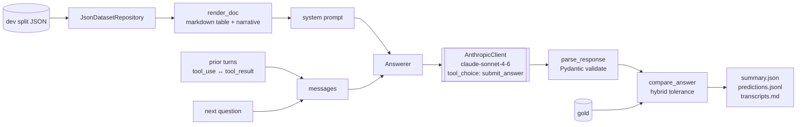
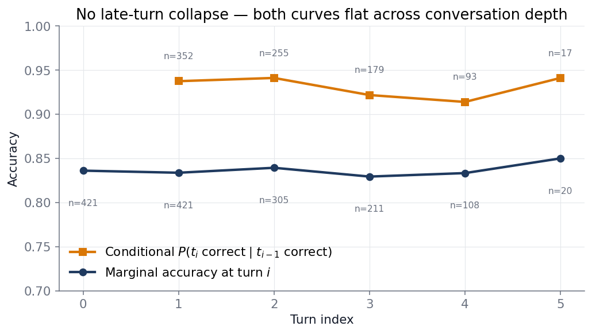
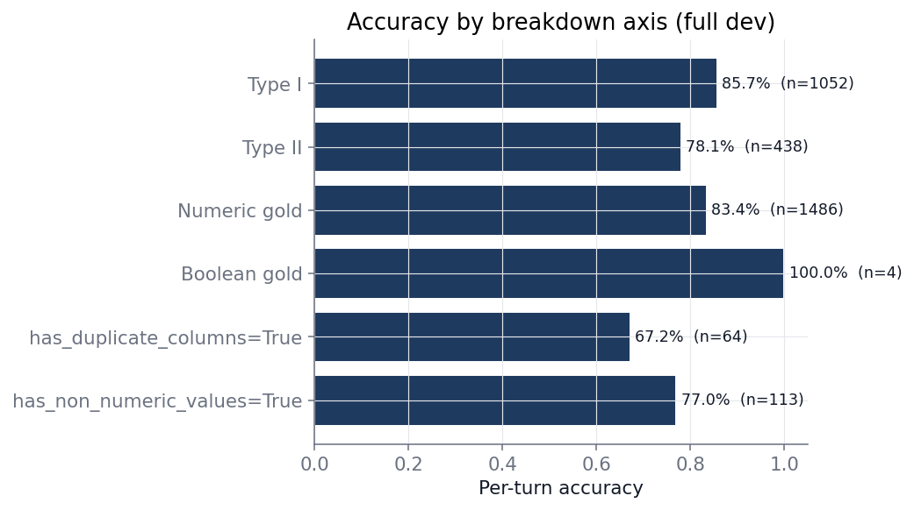
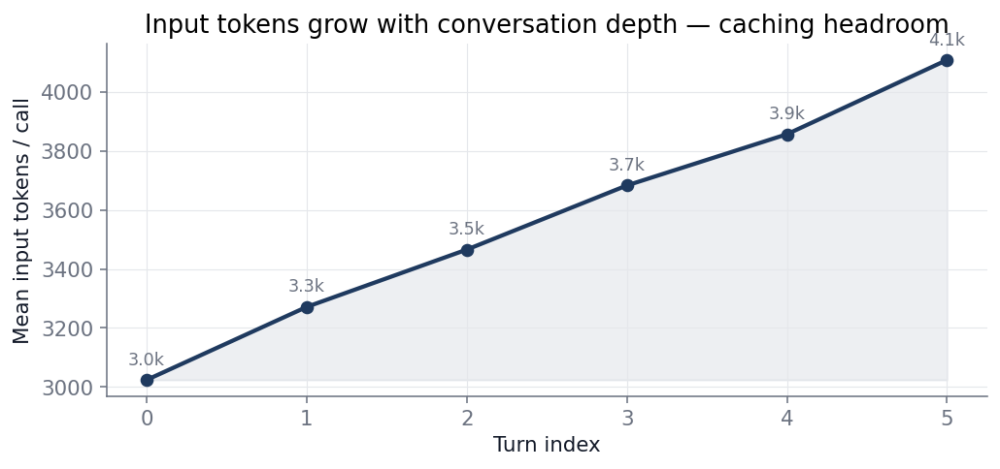

# ConvFinQA Report

## TL;DR

- Frontier LLM (`claude-sonnet-4-6`) with native tool-use over a typed `submit_answer` tool, full conversation replay, no retrieval, no fine-tuning, no DSL. Headline on the 421-record dev split: **83.5% per-turn, 73.6% per-conversation** (free-running, $19.04 total, 72 min wall).
- The paper's "later turns are harder" finding (sec 5.3, fig 5) does not reproduce on a 2026 model. Conditional accuracy `P(t_i correct | t_{i-1} correct)` is flat at ~92% across t1–t5 — the marginal drop is compounding, not long-context degradation. That single result reshapes the future-work list.
- Three error clusters dominate residual failure: upstream cleaned-table / gold misalignment (data-side), sign-vs-magnitude reasoning on financial cell conventions (model-side), and column / row selection on multi-column tables (renderer-side). Different fixes for each.

## Priorities

This submission optimised for **quality > cost ≫ speed**. Latency is unbudgeted. Cost is bounded by "single full-dev run under $20" (came in at $19.04). Quality is the only metric being optimised against. The architectural decisions below are read against that ranking — a deployment with tight latency or per-call cost budgets resolves several of them differently (caching, model choice, ensemble use). The Production track in [Future work](#future-work) spells those out.

Concrete consequence: **prompt caching is unimplemented in v1.** Sized estimate is ~60-75% input-cost reduction (full-dev $19 → ~$8-10; see [Strengths and limitations § Cost arithmetic](#cost-arithmetic-estimated-not-measured)) — a deliberate scope cut to keep the measurement loop boring during baseline iteration. First item on the production track.

## Method



End-to-end pipeline: load → render → prompt → forced tool-use → parse → score. One LLM provider (Anthropic, `claude-sonnet-4-6`), one tool (`submit_answer`), full conversation replay. The document goes only in the system prompt; prior turns replay as `(user, q) → (assistant, tool_use) → (user, [tool_result, next_question])` triples. No fine-tuning, no custom retrieval, no agent loop. The 2022 paper's DSL is treated as eval metadata, not a generation target.

Forced `tool_choice` collapses output parsing to schema validation: the response either parses against the Pydantic schema or fails loudly. The `LLMClient` and `DatasetRepository` are `Protocol`s; `AnthropicClient` and `JsonDatasetRepository` are the only adapters wired in. Tests substitute a `_FakeLLMClient` — no API key required. Predictions and per-call audit trails persist to `runs/<UTC-timestamp>/{predictions.jsonl, transcripts.jsonl, transcripts.md, summary.json}`.

**Cleaning policy: do nothing.** Cells pass through verbatim. The dataset card markers (`'-'`, `'n/a'`, `'( in thousands )'`, `(1)`/`(2)` column suffixes) are semantically meaningful, not dirty — coercing them changes meaning. See [`docs/decisions.md`](docs/decisions.md). Validated empirically: dev breakdowns on `has_duplicate_columns` / `has_non_numeric_values` are tracked in every run.

**Repo tour.** `src/domain/` — Pydantic types, no IO. `src/services/` — LLM seam (`anthropic.py`), answerer, evaluator, transcripts. `src/repository/` — dataset IO. `src/prompts/` — system prompt and renderers. `src/cli/` — `main.py` (eval) and `scripts.py` (`dump-failures`, `plot-results`). Tests mirror `src/`. One LLM provider, one tool. No god-files.

**Data-shape gotchas spotted while reading the dataset card.** Each one shaped a decision visible in the code:

- The 434-record test split advertised in the card is **absent** from the shipped JSON. Dev is the only held-out set — flagged in [Limitations](#limitations).
- `turn_program` is provided per turn but is **gold metadata**, not a generation target. The DSL is paper-era; 2026 has structured outputs.
- Boolean (`yes`/`no`) golds (4/1490 dev turns) are easy to lose under a numeric-only metric. They show up as a separate breakdown axis.
- `has_duplicate_columns` and `has_non_numeric_values` flags exist on every record. Used as breakdown axes to validate the do-nothing cleaning policy, not silently dropped.
- Some cleaned cells include `( in thousands )` unit hints. Kept as-is; the model uses them for scale resolution.

## What changed from the paper

The 2022 paper is the obvious baseline; the assignment explicitly rules out blindly reimplementing it with an updated model. Concrete deltas:

| Paper (2022) | This submission | Why |
|---|---|---|
| DSL program is the generation target | DSL is eval metadata only; native tool-use emits a typed `submit_answer` | Structured outputs replaced custom DSLs; Pydantic + named fields are grep-able and testable |
| Retriever-then-generator pipeline | No retriever; doc fits in the system prompt | Median doc is ~675 tokens — long context made retrieval gold-plating |
| Teacher-forced eval (gold prior turns injected) | Free-running eval (model's own prior predictions replay) | Free-running matches deployment; teacher-forced hides cascade failure |
| Exe Acc only | Exe Acc + per-conversation + conditional + per-turn-index | Conditional disambiguates cascade vs late-turn degradation; the others can't |
| Custom encoder for table + text | Markdown rendering + verbatim cells | Cleaning policy validated empirically — see decisions.md |

## Evaluation methodology

Four metrics on the dev split, each reported with sample size alongside the rate:

- **Per-turn execution accuracy** — fraction of turns where `compare_answer` returned True. The standard ConvFinQA metric; reported for comparability with the literature.
- **Per-conversation accuracy** — fraction of records where every turn was correct. Surfaces compounding: 83.5% per-turn compounds to 73.6% per-conversation on a ~3.5-turn dialogue. The customer-facing number.
- **Conditional accuracy** `P(t_i correct | t_{i-1} correct)`, reported as a per-index curve. Disambiguates cascade failure (later turn wrong because earlier turn propagated) from intrinsic late-turn difficulty (model degrades on long context). These warrant different fixes; without conditional, the per-turn-index curve is not actionable.
- **Per-turn-index accuracy curve** — accuracy at each turn position. Plot data for the late-turn-collapse analysis.

Three breakdowns surface the dataset's known difficulty axes: **Type I vs Type II** (paper sec 5.3, 6.3 calls Type II harder), **numeric vs boolean** gold format (different reasoning paths), and `has_duplicate_columns` / `has_non_numeric_values` (validates the cleaning policy on flagged records).

Eval is **free-running**, not teacher-forced: each turn sees the model's own prior predictions in the replayed history. This is stricter than the paper baselines, which inject gold prior turns — so the headline number is not directly comparable to the 45–69% Exe Acc figures in [`dataset.md`](dataset.md). Free-running is the deployment-shaped metric; teacher-forced isolates per-turn skill but hides compounding.

`compare_answer` uses hybrid tolerance `max(tol_abs, tol_rel * |gold|)` with `tol_abs=1e-4`, `tol_rel=5e-3`. Rationale and trigger to revisit are in [`docs/decisions.md`](docs/decisions.md).

Cost reporting (token totals, USD estimate, mean latency by turn index, mean input tokens by turn index) ships in `summary.json` for every run. Pricing source: Sonnet 4.6 list price, $3/MTok input, $15/MTok output, configured via `AnthropicSettings`.

## Results

### Anchored against paper + human baselines

| Method | Per-turn Exe Acc |
|---|---:|
| GPT-3 answer-only (paper) | 24.1 |
| GPT-3 CoT (paper) | 40.6 |
| GPT-3 + DSL (paper) | 45.2 |
| General crowd, n=200 (paper) | 46.9 |
| FinQANet RoBERTa-large + retrieval (paper) | 68.9 |
| **This work, v0 (full dev, free-running)** | **83.5** |
| Human expert, n=200 (paper) | 89.4 |

Caveat: paper rows are teacher-forced; v0 is free-running, which is harder. The numbers are not directly comparable — they are anchors, not a leaderboard claim.

### Late-turn behaviour: no collapse



Both curves are essentially flat across conversation depth. Conditional accuracy stays at 92–94% from t1 to t5; marginal accuracy stays at 83–85%. The drop in per-conversation accuracy with length is compounding under independent error rates, not the model degrading on long context.

### Breakdowns



The expected axes show up: Type II (multi-question composition) is 7–8 points harder than Type I; `has_duplicate_columns=True` records are the worst slice at 67.2% (n=64), 18 points below the rest of dev. The duplicate-columns gap is the empirical signal pointing at error cluster 3 below.

### Cost and token growth



Input tokens grow from 3.0k at t0 to 4.4k by t5 — the system block (doc + instructions, ~2k tokens) is byte-stable across turns of one record but re-tokenised on every call. That's the empirical justification for prompt caching as the first production-track lever.

### Dev measurement manifest

Append-only. Dev is the held-out measurement set; iteration is driven by **train** failure analysis between rows. Hard-capped at v2.

| Version | Seed | Per-turn | Per-conv | USD | Wall | Notes |
|---|---|---|---|---|---|---|
| v0 | 1002385739 | **83.5%** (1244/1490) | **73.6%** (310/421) | $19.04 | 72 min | Baseline. Type I 85.7% / Type II 78.1%. `has_duplicate_columns` 67.2% — flagged. **Headline.** |
| v1 | 1002385739 | 82.7% (1229/1486) | 72.6% (305/420) | $20.88 | 78 min | Train-side prompt iteration; **regressed -0.8pt on dev**. The train delta did not transfer — train and dev distributions diverge on the failure modes the iteration was tuned against. |
| v2 | 1002385739 | n/a | n/a | n/a | n/a | Extended-thinking variant; **aborted** — Anthropic SDK rejects `thinking` blocks combined with forced single-tool selection. Documented as a deliberate scope close, not a silent drop; the proper fix is a tool-interface redesign (see Production track). |

The v0→v1 regression is itself a useful result. The iteration loop on train was real — Phase 2.5 added few-shot examples to teach the newer-minus-older convention, after train-side failure analysis. It just didn't generalise. That's the case the prompt-engineering literature warns about, and the dev manifest discipline is what surfaces it instead of letting it hide under a "we shipped v1" headline.

## Findings

**Paper rebuttal: the late-turn-collapse claim does not reproduce.** Paper sec 5.3 / Figure 5 reports that "later turns in the conversations tend to be harder to answer due to longer reasoning dependencies" and "if the prediction for any turn is wrong, then there is a very minor chance that the subsequent turns are correct." On a 2026 frontier model with full conversation replay, neither holds: conditional accuracy is flat at ~92%, marginal accuracy is flat at ~83%, and the drop in per-conversation accuracy with length is the expected independent-error compounding. The model-degradation effect the paper observed has effectively been engineered out by long-context training. What remains is cascade — and cascade is much smaller than expected at this conversation length.

This shapes the future-work list. Time spent on context summarisation, retrieval, or sliding-window prompting would not target the actual failure mode. The error clusters below are where residual headroom lives.

## Error analysis

Three clusters dominate residual failure on dev. Each lives in a different layer; each warrants a different fix.

### Cluster 1 — Upstream cleaned-table / gold misalignment (data-side)

The cleaned table and the gold answer occasionally disagree on which row corresponds to which year. Concrete: on `Double_ETR/2002/page_86.pdf` the cleaned table has `2005=540372, 2004=925005`, but gold treats `540372` as 2004 (confirmed by t3 gold `0.71179 = 384633 / 540372`). No question-side semantic cue lets the model recover this — *"what was the total in 2005?"* against a table that pins `2005=540372` admits exactly one answer. Unrecoverable from the model side.

### Cluster 2 — Sign vs magnitude on financial cell conventions (model + prompt)

The cleaner deterministically maps parens → negative, faithful to one common 10-K convention; the other (parens-as-display, with the question framing implying magnitude) is the model's job to resolve. Concrete: `Single_PM/2018/page_31.pdf-2` t0 — *"what was the weighted average discount rate for postretirement plans in 2018?"*, cell `-3.97`, gold `3.97`. `Double_PM/2015/page_127.pdf` t0 — column header `( losses ) earnings 2015`, cell `-9402`, question asks for "the losses", gold `9402`. The model returns the signed cell verbatim instead of resolving "is the question asking for a magnitude or a signed value?" A counter-pattern exists too (`Single_C/2010/page_223.pdf-3` t2: gold `-433`, model returns `433`), so the bias isn't "always signed" — it's "follow the cell or arithmetic without checking the question." Rules out a blanket "return magnitude" rule; motivates a structural prompt change that forces the magnitude-vs-signed decision before extraction.

### Cluster 3 — Column / row selection on multi-column tables (renderer + prompt)

`has_duplicate_columns=True` records score 67.2% (n=64), 18 points below the rest of dev. The model picks the wrong column or row when the markdown table has visually flat column boundaries — a rendering problem dressed up as a model problem. The fix vector is renderer-side first (HTML tables with explicit `<th scope="col">`, or row-major rendering with column repetition) before any prompt-side change. This cluster opens a future-work item the previous error analysis missed.

### Cluster shape against priorities

The three clusters split cleanly along the cost / speed / quality axes. Cluster 1 is **honesty cost** — surfacing it lowers the headline number but raises the report's signal. Cluster 2 is a **quality lever, cheap** — a prompt change with no latency or cost impact. Cluster 3 is a **quality lever, structural** — a renderer change costs engineering time but no per-call cost or latency. None of them require a model swap or fine-tune. That ordering is why the immediate-track future work is what it is.

## Strengths and limitations

### Strengths

- **Conditional accuracy reported as a headline metric, not just a slice.** Distinguishes cascade from degradation in one number. Most reports of this kind only report per-turn.
- **Free-running eval** rather than teacher-forced — matches deployment, harder than the literature.
- **Sample sizes on every rate.** No "100% (n=3)" hidden in a row.
- **Per-call audit trail.** Every prediction is reproducible from `transcripts.md`; failure analysis runs off real artefacts, not memory.
- **Append-only dev manifest** with v0 / v1 / v2 visible — including the v1 regression and the v2 abort. Nothing is silently re-baselined.
- **Decisions are recorded with triggers-to-revisit** in [`docs/decisions.md`](docs/decisions.md). The seams are documented, not implicit.

### Limitations

- **Dev is the only held-out split in the shipped JSON.** The 434-record test split advertised in the dataset card is absent. Dev was used both as the evaluation set and (lightly) as the prompt-iteration set — the headline is "best-effort on dev," not a true held-out estimate.
- **Cluster 1 is a dataset / cleaning artefact** the model cannot recover from inputs alone. Reporting raw accuracy charges those records against the model unfairly. The honest move is a quarantine flag (see Future work).
- **No prompt caching.** The rendered doc + instructions block is byte-stable across the 3–4 turns of one record but re-tokenised on every call.
- **One LLM provider.** `services.anthropic` carries the lock-in honestly; a second adapter is the right time to abstract.

#### Cost arithmetic (estimated, not measured)

Full-dev v0 actuals: 5.0M input + 269k output tokens, $19.04, 72 min wall. The system block (rendered doc + instructions, ~2k of each ~3.4k-token call) is byte-stable across turns of one record and reused 3–4× within ~20s — well inside the 5-minute prompt-cache TTL. Routing it through Anthropic's prompt cache (cached read at $0.30/MTok — 10% of base) plausibly saves **~60–75% of input cost**, depending on how much of the prior-turn replay also lands inside the TTL. Sized estimate: full-dev cost drops from **$19 to ~$8–10**, with no quality impact and a small first-call latency overhead. Estimated, not measured — caching wasn't implemented in v1.

## Future work

### Immediate (given observed failure modes)

1. **Prompt caching on the system block.** Cost lever; ~60–75% input-cost reduction estimated above. No quality impact, no implementation risk beyond cache-key hygiene. First lever to pull.
2. **Domain-primed prompt pass for sign / magnitude (cluster 2).** Force the magnitude-vs-signed decision as an explicit step before extraction. Not a rule list (`if discount-rate then flip` doesn't generalise); a structural prompt move primed by parens-as-display vs parens-as-negative conventions.
3. **Alternate table renderings (cluster 3).** Markdown is a weak format for multi-column disambiguation. Cheap experiment: re-run dev with HTML rendering and explicit column-scope markers, compare per-record accuracy on `has_duplicate_columns=True` records. Ship the rendering change before any further prompt edit.
4. **Quarantine flag for cluster-1 records.** If they account for a meaningful share of residual error, surface them as a separate axis in the breakdown rather than charging them against model accuracy. Flag-and-exclude is more honest than silently absorbing the loss.
5. **Tighter `compare_answer` for boolean golds.** A few boolean records have non-string golds; the metric currently dispatches on `isinstance(gold, str)`.
6. **`calculate(expression)` tool with a return loop** — only if arithmetic errors materially exceed extraction errors. Currently calc-consistency (model's reported answer matches eval of its own calculation string) appears high by eyeball; verify before adding tool surface.

### Production track (if quality / cost / speed priorities shifted)

Ordered by the priority hierarchy a real deployment would set, not by failure-mode ROI:

1. **Trial alternative models.** Sonnet 4.6 was chosen on benchmark + price; the actual question is *which model is on the Pareto frontier for ConvFinQA-shaped tasks*. Cheap one-off: rerun dev on Haiku 4.5, Opus 4.7, GPT-5.2 at fixed seed. Dominant lever on both quality and per-call cost. Should run before any of the items below.
2. **Extended thinking / longer reasoning chains.** v2 attempted this and was aborted: the current single-tool, forced-`tool_choice` setup is incompatible with extended thinking in the Anthropic SDK. Doing this properly means redesigning the tool interface — switch to `tool_choice: auto` with two tools (`calculate(expression)` and `submit_answer`), and let the model decide when to think, when to call calc, and when to submit. Non-trivial rewrite, not a flag flip. Worth doing in production because the underlying capability is real; out of scope here because the current approach isn't tooling-bottlenecked.
3. **Ensemble + consensus.** Sample-N from one model (self-consistency) is the cheap version; cross-model voting is the expensive one. N× cost and latency for sub-linear quality gain — only worth it where every wrong answer is expensive (regulated finance, audit). Bad fit for chat UX.
4. **Prompt optimisation: MIPROv2 first, GEPA if it plateaus.** ConvFinQA is unusually well-suited to numeric optimisation because the judge — `compare_answer` — is deterministic. That removes the calibration friction that breaks DSPy-style pipelines in most production systems. **MIPROv2** is the right first move: Bayesian optimisation over instruction text + few-shot demos, binary reward from exact-match scoring, no LLM-judge build needed. **GEPA** is the stronger optimiser but its reflective teacher LLM is itself an LLM-as-judge — building one calibrated against domain-correct critiques (not just exact-match) is the work, not the GEPA loop itself. Order: MIPROv2 first; only build the GEPA judge if MIPROv2 plateaus.
5. **Fine-tuning on FinQA + ConvFinQA train.** Last resort. Headroom is small (frontier model already at 80%+ with no domain adaptation), the data is public, and a fine-tune locks you to one provider. Justifiable only if items 1–4 plateau and the cost-per-call from a small fine-tuned model beats Sonnet API rates at deployment volume.

### Cost / speed / quality lever summary

| Lever | Quality | Cost | Speed | When to deploy |
|---|---|---|---|---|
| Prompt caching | — | ↓↓ | ↑ (cached) | always |
| Different model | ↑↑ | ↓ or ↑ | ↓ or ↑ | first move |
| Extended thinking | ↑ | ↑ | ↓ | quality-priority only |
| Ensemble / consensus | ↑↑ | ↑↑↑ | ↓↓ | regulated / high-stakes |
| MIPROv2 / GEPA | ↑ | one-off | — | after model is fixed |
| Fine-tuning | ↑ (small) | ↓ at scale | ↑ | high-volume + plateau |

What this report deliberately does **not** propose: fine-tuning as a v1 move, custom retrieval, multi-provider abstraction in code, agentic planning. ConvFinQA documents are short (~675 tokens median) and reasoning is shallow (median 2–3 ops). The interesting engineering is honest evaluation, not architectural maximalism.

## Reproducing the run

```
uv run pytest                                            # 58 tests
uv run main eval --n 50 --split train                    # smoke run
uv run main eval --split dev                             # full dev (~75 min, ~$19)
uv run main dump-failures runs/<UTC-ts> --split dev      # per-failure markdown for hand review
uv run main plot-results runs/<UTC-ts>/summary.json      # report charts → figures/
```

Outputs land in `runs/<UTC-timestamp>/`. `predictions.jsonl` is the per-turn detail; `summary.json` is the aggregate; `transcripts.{jsonl,md}` is the per-call audit trail; `failures.md` is hand-readable for error analysis.

## AI tool usage

Built with Claude Code as a pair-programming assistant under the project conventions in [`CLAUDE.md`](CLAUDE.md) and `CLAUDE.local.md`. Those conventions are load-bearing — TDD, small reviewable changes, no AI-tells in checked-in content, no docstrings on the obvious, decisions recorded with triggers-to-revisit. Sub-agents handled parallel research (Anthropic API contract validation, metrics-math audit, code review) and exploratory fan-out; architectural decisions, prompt content, scope cuts, and the report writing were not delegated. Decisions in [`docs/decisions.md`](docs/decisions.md) are the durable record of the calls made.
