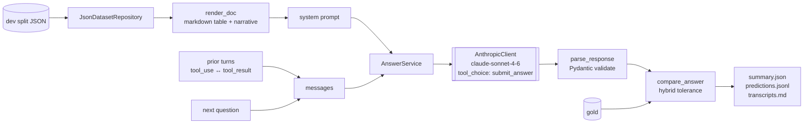
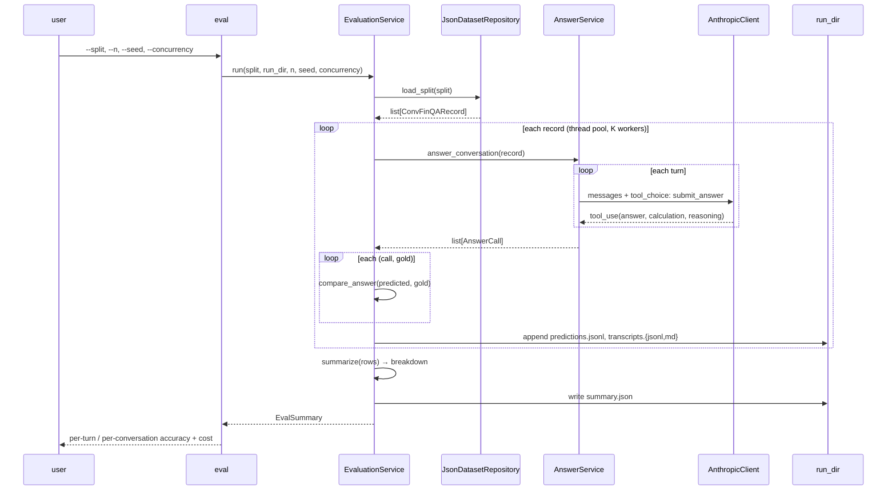

# ConvFinQA Report

## TL;DR

This was a really fun and interesting project to work on.

- Frontier LLM (`claude-sonnet-4-6`) with native tool-use over a typed `submit_answer` tool, full conversation replay, no retrieval, no fine-tuning, no DSL. Headline on the 421-record dev split: **83.5% per-turn, 73.6% per-conversation** (\$19.04 total, 72 min wall).
- The paper's "later turns are harder" finding (sec 5.3, fig 5) does not reproduce on a 2026 model. Conditional accuracy `P(t_i correct | t_{i-1} correct)` is flat at ~92% across t1–t5 — the marginal drop is compounding, not long-context degradation. That single result reshapes the future-work list.
- Three error clusters dominate residual failure: upstream cleaned-table / gold misalignment (data-side), sign-vs-magnitude reasoning on financial cell conventions (model-side), and column / row selection on multi-column tables (renderer-side). Different fixes for each.

## Priorities

Optimised for **quality > cost ≫ speed**. Latency is unbudgeted. Cost was capped at one full-dev run under \$20 (came in at \$19.04). A deployment with different priorities would resolve several of these calls differently — caching, model choice, ensemble use. More in [Future work](#future-work).

## Method



End-to-end pipeline: load → render → prompt → forced tool-use → parse → score. One LLM provider (Anthropic, `claude-sonnet-4-6`), one tool (`submit_answer`), full conversation replay. The document goes only in the system prompt; prior turns replay as `(user, q) → (assistant, tool_use) → (user, [tool_result, next_question])` triples. No fine-tuning, no custom retrieval, no agent loop. The 2022 paper's DSL is treated as eval metadata, not a generation target.

Forced `tool_choice` collapses output parsing to schema validation: the response either parses against the Pydantic schema or fails loudly. The `LLMClient` and `DatasetRepository` are `Protocol`s; `AnthropicClient` and `JsonDatasetRepository` are the only adapters wired in. Tests substitute a `_FakeLLMClient` — no API key required. Predictions and per-call audit trails persist to `runs/<UTC-timestamp>/{predictions.jsonl, transcripts.jsonl, transcripts.md, summary.json}`.

**Cleaning policy: do nothing.** Cells pass through verbatim, including `( in thousands )` unit hints, `'-'` / `'n/a'` markers, and `(1)`/`(2)` column suffixes — semantically meaningful, not dirty. Coercing them changes meaning. See [`docs/decisions.md`](docs/decisions.md). Validated empirically: dev breakdowns on `has_duplicate_columns` / `has_non_numeric_values` are tracked in every run.

A few non-obvious choices the dataset card drove: `turn_program` is treated as gold metadata, not a generation target (the DSL is paper-era; 2026 has structured outputs). Boolean (`yes`/`no`) golds are 4/1490 dev turns — easy to lose under a numeric-only metric, so they get a separate breakdown axis. `has_duplicate_columns` / `has_non_numeric_values` flags become breakdown axes rather than silent drops.

An evaluation pass — `eval --split <split> [--n N] [--seed S] [--concurrency K]` — produces the run directory that everything downstream is graded on:



The `inspect` subcommand follows the same `AnswerService` → `AnthropicClient` path on a single record without writing a run directory, for debugging per-turn reasoning without spinning up a measurement run.

## What changed from the paper

The 2022 paper is the obvious baseline; naively reimplementing its pipeline with an updated model misses the point. Concrete deltas:

| Paper (2022) | This submission | Why |
|---|---|---|
| DSL program is the generation target | DSL is eval metadata only; native tool-use emits a typed `submit_answer` | Structured outputs replaced custom DSLs; Pydantic + named fields are grep-able and testable |
| Retriever-then-generator pipeline | No retriever; doc fits in the system prompt | Median doc is ~675 tokens — long context made retrieval gold-plating |
| Exe Acc only | Exe Acc + per-conversation + conditional + per-turn-index | Conditional disambiguates cascade vs late-turn degradation; the others can't |
| Custom encoder for table + text | Markdown rendering + verbatim cells | Cleaning policy validated empirically — see decisions.md |
| FinQANet best, **68.9%** Exe Acc on dev (with retrieval) | **83.5%** per-turn, **73.6%** per-conversation on dev | Eval setups differ (see [Evaluation methodology](#evaluation-methodology)); human expert on a 200-record sample is 89.4 (paper, n=200) |

## Evaluation methodology

Four metrics on the dev split, each reported with sample size alongside the rate:

- **Per-turn execution accuracy** — fraction of turns where `compare_answer` returned True. The standard ConvFinQA metric; reported for comparability with the literature.
- **Per-conversation accuracy** — fraction of records where every turn was correct. Surfaces compounding: 83.5% per-turn compounds to 73.6% per-conversation on a ~3.5-turn dialogue. The customer-facing number.
- **Conditional accuracy** `P(t_i correct | t_{i-1} correct)`, reported as a per-index curve. Disambiguates cascade failure (later turn wrong because earlier turn propagated) from intrinsic late-turn difficulty (model degrades on long context). These warrant different fixes; without conditional, the per-turn-index curve is not actionable.
- **Per-turn-index accuracy curve** — accuracy at each turn position. Plot data for the late-turn-collapse analysis.

Three breakdowns surface the dataset's known difficulty axes: **Type I vs Type II** (paper sec 5.3, 6.3 calls Type II harder), **numeric vs boolean** gold format (different reasoning paths), and `has_duplicate_columns` / `has_non_numeric_values` (validates the cleaning policy on flagged records).

Eval replays the model's own prior predictions as conversation history at each turn — matches what deployment looks like. The paper's exact eval protocol (whether prior gold answers are injected, omitted, or otherwise) isn't fully specified in the text, so the headline number isn't directly comparable to the 45–69% Exe Acc figures in [`dataset.md`](dataset.md).

`compare_answer` uses hybrid tolerance `max(tol_abs, tol_rel * |gold|)` with `tol_abs=1e-4`, `tol_rel=5e-3`. Rationale and trigger to revisit are in [`docs/decisions.md`](docs/decisions.md).

Cost reporting (token totals, USD estimate, mean latency by turn index, mean input tokens by turn index) ships in `summary.json` for every run. Pricing source: Sonnet 4.6 list price, \$3/MTok input, \$15/MTok output, configured via `AnthropicSettings`.

## Results

### Late-turn behaviour: no collapse


Both curves are essentially flat across conversation depth. Conditional accuracy stays at 92–94% from t1 to t5; marginal accuracy stays at 83–85%. The drop in per-conversation accuracy with length is compounding under independent error rates, not the model degrading on long context.

### Breakdowns


The expected axes show up: Type II (multi-question composition) is 7–8 points harder than Type I; `has_duplicate_columns=True` records are the worst slice at 67.2% (n=64), 18 points below the rest of dev. That gap is what surfaces error cluster 3 below.

### Cost and token growth


Input tokens grow from 3.0k at t0 to 4.4k by t5 — the system block (doc + instructions, ~2k tokens) is byte-stable across turns of one record but re-tokenised on every call. That's the case for prompt caching, on its own.

### Prompt improvement experiments

Prompt improvement iterations were driven by **train** failure analysis between rows. Hard-capped at v2. Dev dataset was held-out.

| Version | Seed | Per-turn | Per-conv | USD | Wall | Notes |
|---|---|---|---|---|---|---|
| v0 | 1002385739 | **83.5%** (1244/1490) | **73.6%** (310/421) | \$19.04 | 72 min | Baseline. Type I 85.7% / Type II 78.1%. `has_duplicate_columns` 67.2% — flagged. **Headline.** |
| v1 | 1002385739 | 82.7% (1229/1486) | 72.6% (305/420) | \$20.88 | 78 min | Train-side prompt iteration; **regressed -0.8pt on dev**. The train delta did not transfer — train and dev distributions diverge on the failure modes the iteration was tuned against. |
| v2 | 1002385739 | n/a | n/a | n/a | n/a | Extended-thinking variant; **aborted** — Anthropic SDK rejects `thinking` blocks combined with forced single-tool selection. Documented rather than dropped; the fix is a tool-interface redesign (see [Future work](#future-work)). |

The v0→v1 regression is itself a useful result. The iteration loop on train was real — Phase 2.5 added few-shot examples to teach the newer-minus-older convention, after train-side failure analysis. It just didn't generalise.

## Findings

**Paper rebuttal: the late-turn-collapse claim does not reproduce.** Paper sec 5.3 / Figure 5 reports that "later turns in the conversations tend to be harder to answer due to longer reasoning dependencies" and "if the prediction for any turn is wrong, then there is a very minor chance that the subsequent turns are correct." On a 2026 frontier model with full conversation replay, neither holds: conditional accuracy is flat at ~92%, marginal accuracy is flat at ~83%, and the drop in per-conversation accuracy with length is the expected independent-error compounding. The model-degradation effect the paper observed has effectively been engineered out by long-context training. What remains is cascade — and cascade is much smaller than expected at this conversation length.

This shapes the future-work list. Time spent on context summarisation, retrieval, or sliding-window prompting would not target the actual failure mode. The error clusters below are where residual headroom lives.

## Error analysis

A post-hoc reflection on the **246 failed turns out of 1490** on the v0 dev run. 

The clusters below informed the future-work list but did **not** drive design changes — the audit trail in `runs/` backs this. 

Prompt iteration were made from analysing the training data: `runs/2026-05-04T13-10-30Z/failures.md` (n=100, 53 failures, 1580 lines), `runs/2026-05-04T09-03-38Z/failures.md` (n=50, 19 failures), `runs/2026-05-04T06-50-41Z/failures.md` (n=50, 21 failures). 

Dev failure artefact: `runs/2026-05-04T06-35-00Z/failures.md` (used for the analysis below; not for prompt iteration).

Examples are labelled `(dev)` or `(train)` so the audit trail is explicit. Failure cards quote the question, the cell or table excerpt, gold, prediction, and the failure mode in one place.

### Cluster 1 — Upstream cleaned-table / gold misalignment (data-side)

**Where it shows up:** rare but unrecoverable when it does. The cleaned table and the gold answer disagree on which row or column corresponds to which year, and no question-side semantic cue lets the model recover.

> **Example: `Double_ETR/2002/page_86.pdf` t0–t4 (dev) — 5 lost turns from one root cause.**
> - **Q (t0):** *"what was the total of annual long-term debt maturities ... for 2005?"*
> - **Cleaned table:** pins `2005 = 540372`, `2004 = 925005`.
> - **Gold for t0:** `925005` — gold treats `925005` as the 2005 row.
> - **Predicted:** `540372` — model reads the table as written.
> - **Confirmation:** t3 gold `0.71179 = 384633 / 540372` proves gold's mental row-mapping puts `540372` on 2004. Years are swapped between the table and the gold programs. No question-side disambiguator exists.

**Recommended Fix:** quarantine flag for records where this fires. Surface them as a separate axis in the breakdown rather than charging them against model accuracy. Detection heuristic: replay the gold program against the rendered table; flag records where the program's referenced cells disagree with the table's row labels.

### Cluster 2 — Sign vs magnitude on financial cell conventions (model + prompt)

**Where it shows up:** **≥8.1% of dev failures (20/246, lower bound** — counts only exact `predicted == -gold` matches; partial-magnitude errors are missed). The cleaner deterministically maps parens → negative, faithful to one common 10-K convention; the other (parens-as-display, with the question framing implying magnitude) is the model's job to resolve.

> **Example A: `Single_PM/2018/page_31.pdf-2` t0 (dev).**
> - **Q:** *"what was the weighted average discount rate for postretirement plans in 2018?"*
> - **Cell:** `-3.97`  ·  **Gold:** `3.97`  ·  **Predicted:** `-3.97`
> - **Why it failed:** model returned the signed cell verbatim. Discount rates are reported in 10-Ks with display-side parens but interpreted as magnitudes; the question's framing ("the discount rate") implies a magnitude.

> **Example B: `Single_IPG/2018/page_26.pdf-2` t5 (train run `2026-05-04T13-10-30Z`).**
> - **Q:** *"and how much is that in percentage?"*
> - **Calc:** `-2074 / 3824 * 100`  ·  **Gold:** `54.2364`  ·  **Predicted:** `-54.236`
> - **Why it failed:** cascaded from t4, where the model picked the signed delta `-2074` instead of the magnitude `2074`. One sign decision propagates through both downstream turns.

> **Counter-example: `Single_C/2010/page_223.pdf-3` t2 (dev).**
> - **Gold:** `-433`  ·  **Predicted:** `433`
> - **Why it matters:** rules out a blanket "return magnitude" rule. The bias isn't *"always signed"* — it's *"follow the cell or arithmetic without checking what the question is asking."*

**Recommended Fix:** structural prompt change forcing an explicit magnitude-vs-signed decision before extraction, primed by parens-as-display vs parens-as-negative conventions. Not a rule list (`if discount-rate then flip` doesn't generalise); a structural reasoning step.

### Cluster 3 — Column / row selection on multi-column tables (renderer + prompt)

**Where it shows up:** `has_duplicate_columns=True` records on dev score **67.2% (n=64)**, **18 points** below the rest of dev's 84.2%. **21 of 64 dup-col records fail** (33% within-slice vs ~16% baseline failure rate). Markdown's flat column boundaries provide weak disambiguation.

> **Example: `Single_HWM/2016/page_40.pdf-1` t0 (dev).**
> - **Q:** *"what is the high price in 2016?"*
> - **Table:** rows include `2016 high (1)` *and* `2016 high (2)` — two `high` series on the same page (different reporting bases), each with `first/second/third/fourth/year` columns.
> - **Gold:** `32.91` (= `2016 high (1) → third`)  ·  **Predicted:** `34.5` (= `2016 high (1) → year`, the natural read of "high price in 2016")
> - **Why it failed:** the question is naturally read as a year-level statistic, but gold expects a specific quarter from a specific reporting series. The duplicate-column ambiguity gives the model no signal to pick the right one.

**Recommended Fix:** renderer-side first — HTML tables with explicit `<th scope="col">`, or row-major rendering with column repetition — before any prompt-side change. The dup-col gap is a rendering problem dressed up as a model problem.

### Cluster 4 — Downstream cascade from a single early error

**Where it shows up:** **largest single bucket by lost-turn count.** **29 dev records** have ≥3 wrong turns with at least 3 consecutive losses, accounting for **109 of 246 dev failures (44%)**. Train n=100 mirrors this: **6 records / 25 lost turns / 47% of failures**. The root cause is always one of clusters 1–3, but cascade is where the loss *concentrates*.

> **Example: `Single_AMT/2010/page_34.pdf-1` t0–t3 (dev) — 1 wrong cell pick → 3 lost turns.**
>
> | turn | Q | gold | predicted | calc |
> |---|---|---|---|---|
> | t0 | closing price as of 2/11/11? | `56.73` | `56.73` ✓ | `56.73` |
> | t1 | high price for the quarter ended 12/31/10? | `53.14` | **`43.84`** ✗ | `43.84` |
> | t2 | difference between these two prices? | `3.59` | `12.89` ✗ | `56.73 - 43.84` |
> | t3 | growth rate during this time? | `0.06756` | `29.40` ✗ | `(56.73 - 43.84) / 43.84` |
>
> **Why it failed:** t1 picks the wrong row from a multi-row quarterly price table — a cluster-3-shaped error. t2 and t3 use the model's own (incorrect) prior answers, so the wrong number propagates. The model's arithmetic is *correct* at every step from t1 onwards; the chain's anchor is wrong.

**Why this is its own cluster, not just compounding:** the conditional-accuracy chart shows `P(t_i correct | t_{i-1} correct)` flat at ~92%. That confirms the cascade isn't long-context degradation — it's a one-shot error whose downstream effect is amplified by full-history replay. The fix is upstream (cluster 1–3 fixes reduce cascade rate), but cascade is the right unit to measure the *cost* of those upstream errors.

**Recommended Fix:** cascade rate is a function of cluster-1/2/3 fix rate. Direct mitigations (re-asking the model to verify a prior answer before reuse, surfacing prior-turn confidence) trade quality against latency — not the right early move when the upstream fixes are cheaper. Worth tracking as a downstream metric, not a primary lever.

## Strengths and limitations

### Strengths

- **Conditional accuracy reported as a headline metric, not just a slice.** Distinguishes cascade from degradation in one number. Most reports of this kind only report per-turn.
- **Full-history replay** at each turn — the model's own prior predictions are replayed as conversation context, matching deployment.
- **Sample sizes on every rate.** No "100% (n=3)" hidden in a row.
- **Per-call audit trail.** Every prediction is reproducible from `transcripts.md`; failure analysis runs off real artefacts, not memory.
- **Append-only dev manifest** with v0 / v1 / v2 visible — including the v1 regression and the v2 abort. Nothing is silently re-baselined.
- **Decisions are recorded with triggers-to-revisit** in [`docs/decisions.md`](docs/decisions.md). The seams are documented, not implicit.

### Limitations

- **Dev is the only held-out split in the shipped JSON.** The 434-record test split advertised in the dataset card is absent. Dev was used both as the evaluation set and (lightly) as the prompt-iteration set — the headline is "best-effort on dev," not a true held-out estimate.
- **Cluster 1 is a dataset / cleaning artefact** the model cannot recover from inputs alone. Reporting raw accuracy charges those records against the model unfairly. The honest move is a quarantine flag (see Future work).
- **No prompt caching.** The rendered doc + instructions block is byte-stable across the 3–4 turns of one record but re-tokenised on every call.
- **One LLM provider.** `services.anthropic` carries the lock-in honestly; a second adapter is the right time to abstract.

#### Cost arithmetic (estimated, not measured)

Full-dev v0 actuals: 5.0M input + 269k output tokens, \$19.04, 72 min wall. The system block (rendered doc + instructions, ~2k of each ~3.4k-token call) is byte-stable across turns of one record and reused 3–4× within ~20s — well inside the 5-minute prompt-cache TTL. Routing it through Anthropic's prompt cache (cached read at \$0.30/MTok — 10% of base) plausibly saves **~60–75% of input cost**, depending on how much of the prior-turn replay also lands inside the TTL. Sized estimate: full-dev cost drops from **\$19 to ~\$8–10**, with no quality impact and a small first-call latency overhead. Estimated, not measured — caching wasn't implemented in v1.

## Future work

### What I'd ship next

1. **Prompt caching on the system block.** Cost lever; ~60–75% input-cost reduction estimated above. No quality impact, no implementation risk beyond cache-key hygiene. First lever to pull.
2. **Domain-primed prompt pass for sign / magnitude (cluster 2).** Force the magnitude-vs-signed decision as an explicit step before extraction. Not a rule list (`if discount-rate then flip` doesn't generalise); a structural prompt move primed by parens-as-display vs parens-as-negative conventions.
3. **Alternate table renderings (cluster 3).** Markdown is a weak format for multi-column disambiguation. Cheap experiment: re-run dev with HTML rendering and explicit column-scope markers, compare per-record accuracy on `has_duplicate_columns=True` records. Ship the rendering change before any further prompt edit.
4. **Quarantine flag for cluster-1 records.** If they account for a meaningful share of residual error, surface them as a separate axis in the breakdown rather than charging them against model accuracy. Flag-and-exclude is more honest than silently absorbing the loss.
5. **Tighter `compare_answer` for boolean golds.** A few boolean records have non-string golds; the metric currently dispatches on `isinstance(gold, str)`.
6. **`calculate(expression)` tool with a return loop** — only if arithmetic errors materially exceed extraction errors. Currently calc-consistency (model's reported answer matches eval of its own calculation string) appears high by eyeball; verify before adding tool surface.
7. **Domain-expert commentary, then axial coding of the failures.** The cluster 1–4 taxonomy is open coding — I read ~50 failures and grouped what I saw. Next move: have a finance-literate reviewer write a couple of sentences per failure (what should have happened, why the model went wrong, any edge cases worth flagging), then embed those notes and cluster them. That turns the open codes into axial ones — categories grounded in expert reasoning instead of my reading, with sub-types I'd otherwise miss (cluster 2 likely splits into "discount-rate sign" vs "parens-as-display" with different fixes). Also gives a defensible frequency count for prioritising the fixes above; the current cluster sizes are eyeball estimates.

### If priorities shifted in production

Ordered by the priority hierarchy a real deployment would set, not by failure-mode ROI:

1. **Trial alternative models.** Sonnet 4.6 was chosen on benchmark + price; the actual question is *which model is on the Pareto frontier for ConvFinQA-shaped tasks*. Cheap one-off: rerun dev on Haiku 4.5, Opus 4.7, GPT-5.2 at fixed seed. Dominant lever on both quality and per-call cost. Should run before any of the items below.
2. **Extended thinking / longer reasoning chains.** v2 attempted this and was aborted: the current single-tool, forced-`tool_choice` setup is incompatible with extended thinking in the Anthropic SDK. Doing this properly means redesigning the tool interface — switch to `tool_choice: auto` with two tools (`calculate(expression)` and `submit_answer`), and let the model decide when to think, when to call calc, and when to submit. Non-trivial rewrite, not a flag flip. Worth doing in production because the underlying capability is real; out of scope here because the current approach isn't tooling-bottlenecked.
3. **Ensemble + consensus.** Sample-N from one model (self-consistency) is the cheap version; cross-model voting is the expensive one. N× cost and latency for sub-linear quality gain — only worth it where every wrong answer is expensive (regulated finance, audit). Bad fit for chat UX.
4. **Prompt optimisation: MIPROv2 first, GEPA if it plateaus.** ConvFinQA is unusually well-suited to numeric optimisation because the judge — `compare_answer` — is deterministic. That removes the calibration friction that breaks DSPy-style pipelines in most production systems. **MIPROv2** is the right first move: Bayesian optimisation over instruction text + few-shot demos, binary reward from exact-match scoring, no LLM-judge build needed. **GEPA** is the stronger optimiser but its reflective teacher LLM is itself an LLM-as-judge — building one calibrated against domain-correct critiques (not just exact-match) is the work, not the GEPA loop itself. Order: MIPROv2 first; only build the GEPA judge if MIPROv2 plateaus.
5. **Fine-tuning on FinQA + ConvFinQA train.** Last resort. Headroom is small (frontier model already at 80%+ with no domain adaptation), the data is public, and a fine-tune locks you to one provider. Justifiable only if items 1–4 plateau and the cost-per-call from a small fine-tuned model beats Sonnet API rates at deployment volume.

### Cost / speed / quality lever summary

| Lever | Quality | Cost | Speed | When to deploy |
|---|---|---|---|---|
| Prompt caching | — | ↓↓ | ↑ (cached) | now |
| Different model | ↑↑ | ↓ or ↑ | ↓ or ↑ | now |
| Extended thinking | ↑ | ↑ | ↓ | quality-priority only |
| Ensemble / consensus | ↑↑ | ↑↑↑ | ↓↓ | regulated / high-stakes |
| MIPROv2 / GEPA | ↑ | one-off | — | after model is fixed |
| Fine-tuning | ↑ (small) | ↓ at scale | ↑ | high-volume + plateau |

## Reproducing the run

```
uv run pytest                                            
uv run main eval --n 50 --split train                    # smoke run
uv run main eval --split dev                             # full dev (~75 min, ~$19)
uv run main dump-failures runs/<UTC-ts> --split dev      # per-failure markdown for hand review
uv run main plot-results runs/<UTC-ts>/summary.json      # report charts → figures/
uv run main inspect "Double_MAS/2012/page_92.pdf"        # replay one record, predicted vs gold per turn
uv run main chat "Double_MAS/2012/page_92.pdf"           # REPL over one record, history preserved
```

Outputs land in `runs/<UTC-timestamp>/`. `predictions.jsonl` is the per-turn detail; `summary.json` is the aggregate; `transcripts.{jsonl,md}` is the per-call audit trail; `failures.md` is hand-readable for error analysis.

## AI tool usage

Built with Claude Code as a pair-programming assistant under the project conventions in [`CLAUDE.md`](CLAUDE.md) and `CLAUDE.local.md`. Those conventions are load-bearing — TDD, small reviewable changes, no AI-tells in checked-in content, no docstrings on the obvious, decisions recorded with triggers-to-revisit. Sub-agents handled parallel research (Anthropic API contract validation, metrics-math audit, code review) and exploratory fan-out; architectural decisions, prompt content, scope cuts, and the report writing were not delegated. Decisions in [`docs/decisions.md`](docs/decisions.md) are the durable record of the calls made.
