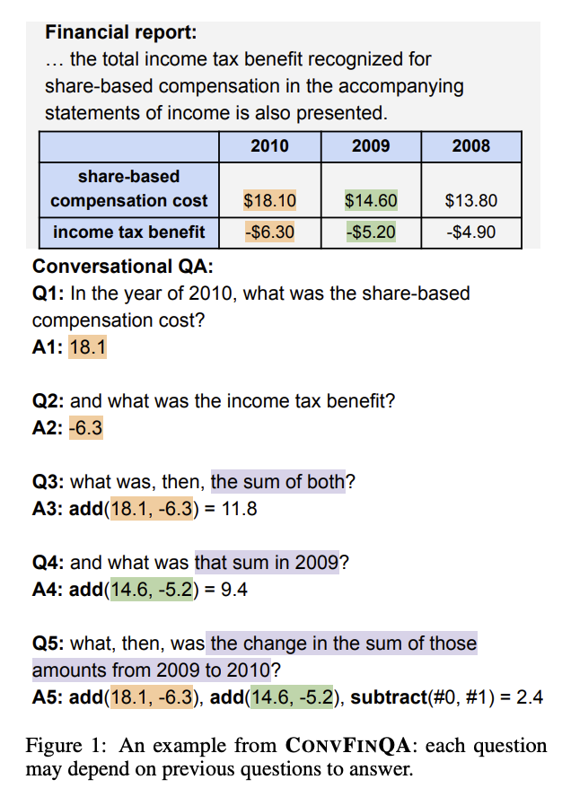

# **The Assignment**

*We kindly ask that you complete this task within one week. If this is not possible, please let us know a suitable date.*

## The Task

We’d like you to demonstrate a **LLM** driven prototype that can answer conversational dialogue questions on any given financial document. For this task we ask you to use a cleaned version of the **ConvFinQA** Dataset. 

<aside>
👉

This dataset consists of multi-hop numerical reasoning questions over semi-structured financial documents, containing text & datatables.

</aside>

We would like to see what you can build with the data provided. Feel free to present the results in any format you prefer and explore any additional ideas you have with the dataset. You may use any model or architecture of your choice. **The goal is to demonstrate your knowledge and experience.** We are particularly interested in the logic and reasoning behind your choice of accuracy metrics and your ability to communicate your solutions and ideas effectively.

Here is an example question from the [paper](https://arxiv.org/pdf/2210.03849) : 

### What we give you:

- A repo with *cleaner* version of the ConvFinQA Dataset.
- A dataset card [`dataset.md`](http://dataset.md) which contains information on the dataset fields and key highlights from the original [paper](https://arxiv.org/pdf/2210.03849) .
- Some light boilerplate to get you started

## What to Produce

- **[~75% time allocation]** A solution implementation to ConvFinQA
    - Code quality and structure will be evaluated.
- **[~25% time allocation]** A report write-up of your method, findings and shortcomings
    - Please explain your choice of method for this task.
    - Please include an honest assessment of your system's strengths and limitations
    - **You don't have to implement all your ideas, but do communicate them to us.** What would you do if you had more time?

<aside>
👉

We do not seek overly complicated solutions—we strongly believe in optimal design within the given timeframe. Complexity does not equal sophistication.

</aside>

Please note:

- Blindly reimplementing the same system as the paper with an updated base model is not sufficient. We expect a solution more appropriate to this task given advancements in LLMs since the paper release.

## How to submit the assignment

Please make a PR to main, in the PR should contain: 

- A solution to the main task
- A report to summarise your findings, we have sketched out a template for you in `REPORT.md` but you can use latex etc if you prefer.
- Please send a link of the PR to [recruitment@tomoro.ai](mailto:recruitment@tomoro.ai) with the subject `submission: <your name>